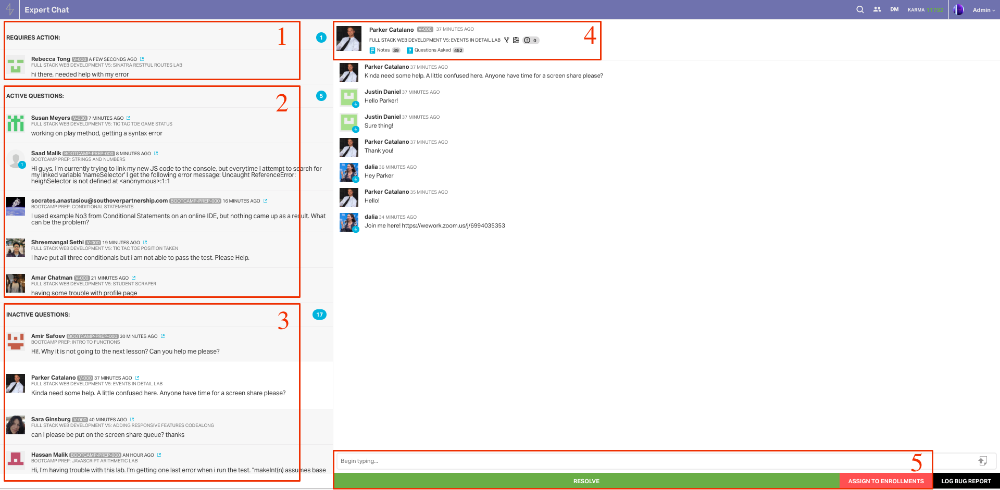
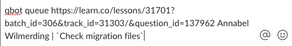
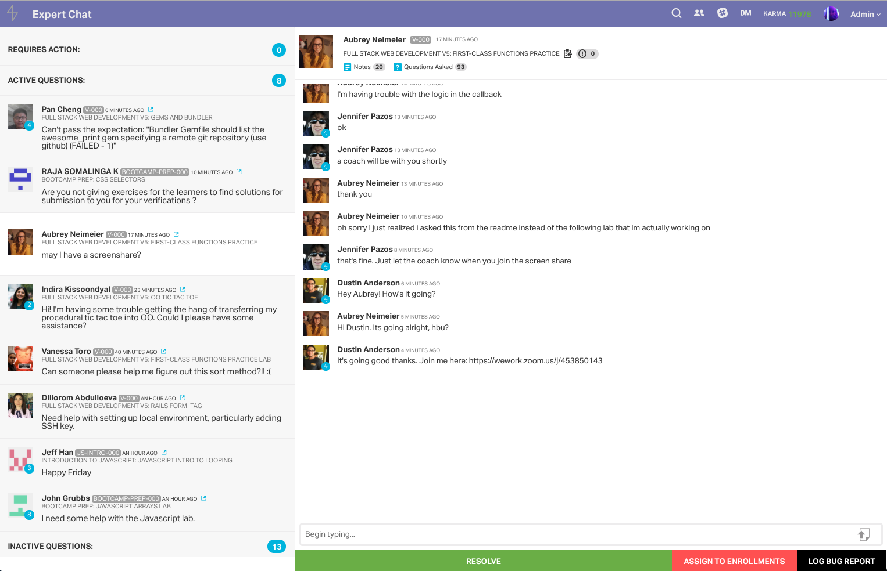
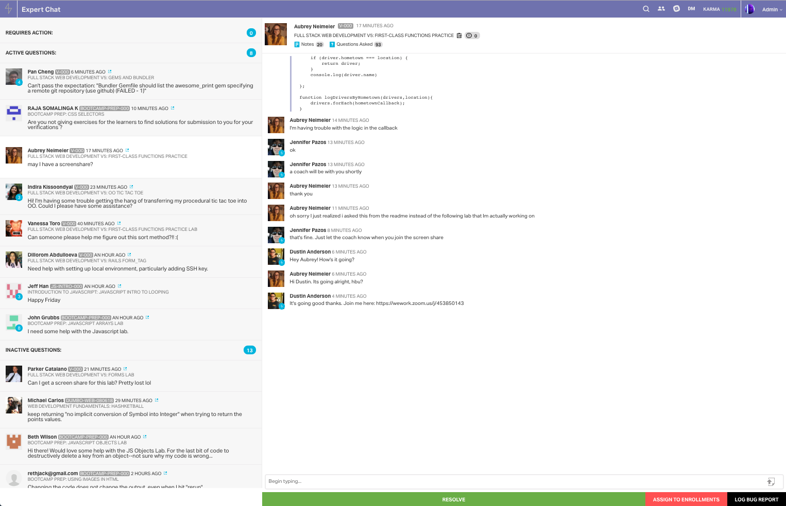
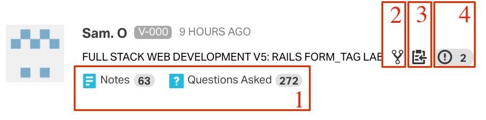

# Dispatch Best Practices

If this is the first shift of the day, the coaches that are currently on will need to decide which of them will be working dispatch (normally a more seasoned coach will take this role). If you are taking dispatch you will need to `qbot in dispatch` in the #technical-coaches channel. Remember, that you need to make sure you have another coach standing by to take dispatch once your shift has ended. 

## What Even is a Dispatch?

Dispatch can seem overwhelming at first. There's a lot going on and an endless supply of students needing help! The dispatcher acts as the gatekeeper between the students and the TCs that are in sync. It is the dispatcher's job to keep things organized and to make sure that each student is attended to. It can seem intense when there are many active questions but stay calm and remember that you've got a whole team of people who are ready to help! As with anything, the more you do it, the better you will get. 

## The Interface

Let's take a look at some of the expert-chat basics:

1. `Requires Action`: This is where all of the incoming questions initially show up. Questions will also be moved into this section when they have been waiting for a response from a tech coach for more than 15 minutes. The questions that pop up here take priority. Greet students quickly! They will appreciate your prompt response.

2. `Active Questions`: This section contains the students that you are actively chatting with. Pay close attention to the blue circles that appear over the student's profile picture. The number in the blue circle tells you how many messages they have sent without being responded to. Try to keep these questions completely clear of the blue by responding to students quickly and effectively. 

3. `Inactive Questions`: This section contains students that have not responded to a coach in over 15 minutes. It's a good idea to check these questions occasionally if it is slow to make sure that no student is waiting for a response or screen share from a tech coach! You will also want to resolve questions that have been inactive for over 8-10 hours. 

4. `Student and Lab Information`: This is arguably one of the most informative pieces of the expert chat UI. It is here where you can see how many questions the student has asked in total as well as how many notes have been taken on that student. You can also find the lab name, link, and how many issues are currently raised on the lab. (I will go into greater detail later in this guide)

5. `Chat Bar, Resolve Button, and Enrollments Button`: As you might have guessed, this is where you will message the student. You can also find the button to resolve the question as well as the button to assign the question to admissions.
    - The `ASSIGN TO ENROLLMENTS` button will resolve the question - so be sure to let the student know before pressing this.
    - When resolving old questions make sure to let the student know the question had been inactive and you are resolving. You will want to say something like this: 
        >Hey there! This question looks like it's been inactive for quite some time, so I'm going to resolve. Please feel free to open a new one next time you're stuck! :)

## Dispatch Goals

When you are working dispatch you are the first person a student will encounter and first impressions **definitely** count. It is your job to ensure that the student starts out on the right foot. Even though it may seem like you will only be chatting with a student for just a few minutes you have the power to make or break a session. 

As the dispatcher, you also have a large influence on how a shift in general will play out. If you queue everything up without trying to solve easier issues over chat you will likely cause a long queue and wear out your fellow TCs. A good dispatcher can strike a balance by handling easier issues via chat and sending more complicated ones to screen shares.

Try to keep these goals in mind as you make your way through a dispatch shift:

1. **Express Kindness and Be Engaged:**
Always greet the student quickly and with a smile. Instead of diving straight into the issue, first ask the student "How are you today? :)"

2. **Decipher the Issue:**
Have the student send you their code along with the error. Use your judgement and decide whether this student is best suited in a screen share or if it's something you can handle over chat.

3. **Monitor TC Screen Share Times:** 
If it's busy you will want to make sure the TCs in sync are staying within the 20 minute range. Use `qbot who is on?` to show you who is on a screen share and for how long. If they're at the limit ping them to let them know! (You could do something like `@thanos :timer:` in Slack!)

4. **Support Your Fellow TCs:**
Occasionally some truly exceptional issues will come up. You normally will be able to tell quickly if an issue is severe if you've gathered enough information in chat. In these cases a TC might be in a long screen share for a reason. Direct message the TC and ask them if everything is going ok or if they need help. Offer assistance if you are able to, help escalate if necessary(form for more help or JIRA ticket), or have another TC join them if possible and necessary.

5. **Offering Resources:**
In AAQ we are only supposed to help with issues related to the lab work. Sometimes there will be questions you can't support. If the student is asking about requirements, tuition, or anything else about the course like that, you will want to assign the question to admissions. If they're asking for help on a portfolio project you will want to direct them to 1:1 support.

## Conversation Flow

Conversations over text can come across as dry and robotic at times. When speaking with a student be a genuine person. A student who has been struggling for over an hour might be a bit on edge. It's important that you come across kind and encouraging throughout the chat. Emojis are a good way to set the tone to a relaxed and welcoming one so I use them often.

Aside from creating a welcoming environment you'll generally want to follow a flow similar to this when chatting with a student:

>Hello [NAME]!

>How are you doing today? :) (Allow them time to respond to this question)

>May I see your code and errors please?

Once you've gotten a glimpse of the errors you will decide if they need a screen share or if it's something that you can solve over chat.

If you feel that they may need a screen share you can say something like this:

>This lab is pretty tough! Are you available to pair up with a tech coach to help debug? :)

If you have helped a student over chat be sure to follow up with encouragement:

>Awesome work! You did great figuring that out :)

## Assigning a Question

Once you have the student's code and error you should be able to decipher quickly whether or not this is something you can support over chat. To assign the question you will want to use `qbot queue`. 

If you can and you believe it is helpful you may want to add a comment to the assignment regarding the student. This could be a hint or a heads up. The TC that gets assigned will be grateful!

Here's an example of a comment you might add: 

## Managing Questions

Handling the volume of questions can be quite a challenge at times. However, it is still your job as dispatcher to remain calm and in control. Follow the tips below and you will be able navigate even an exceptionally busy shift:

1. **Be Aware at All Times:** You likely are helping at least one student debug via chat. Don't get too drawn in that you ignore everything else. Be sure that the `Requires Action` section is always in view on your screen. Every couple of minutes or so you will want to check that you can see the bottom of the `Active Questions` tab. (Sometimes students will respond to a question that has been in the `Inactive` section and they can be easy to miss if you aren't checking often) You should also take the time every 5 minutes or so to click on each question from the bottom of `Active` to the top. You will want to do this just to make sure that each student is getting the help that they need and you aren't missing anyone.

2. **`qbot who is on?`:** It is really important for the dispatcher to know how long TCs have been in a screen share. This is especially true when it is busy and there is a queue. If you are on a queue or close to being on queue take a look at what the TCs in sync are doing. Make sure that they are within their 20 minute time range by using `qbot who is on?` as often as necessary. If you see that they are over on their time be sure to ping them on Slack!

3. **Prioritize Paid Students:** We support all kinds of students in AAQ - from the in person immersive, to the online Fullstack course, to the free bootcamp prep course. Understand that although we provide help for all of these students we must place priority on those that are paying. Make sure that paying students are assigned to screen shares before the free students. If you have a ton of active questions be sure to pay attention to those who are paying first and once things are under control begin helping the free students. 
    - **Paid Student Examples:** `V-000`, `DUMBO-WEB`, `NYC-WEB`, `Prework`
    - **Free Student Examples:** `BOOTCAMP-PREP`, `JS-INTRO`, `RUBY-APPLY`

4. **Stagger Question Assignments:**  If 3 questions come in at once and you queue them all immediately and you only have 3 TCs in sync you have now created a 20 minute wait. It's likely a 4th student will show up shortly after and they will be stuck waiting. Staggering the question queues can save a ton of time and prevent a massive queue if done correctly. Instead  of queueing everything that walks in, try to pick one student that you think you can support over chat, send one to a screen share, and have the other look at some resources or have them run `learn save`. Even 5 minutes between assignments can help later down the road. 

5. **Keeping Resources on Hand:** You'll get familiar with the issues that come into AAQ quickly if you work dispatch often. It's a good idea to always keep a collection of links and resources handy to send to these students. Always knowing where to find links like the ones to 1:1 support, two minute tidbit videos, and solutions to common issues will help you manage the wait time and the volume of the questions.

## Tips and Tricks

- **Zoom Out:** Expert Chat is really large at the regular resolution. So when I work dispatch I like to keep the screen zoomed out around 75% to 67%. This allows for me to monitor the questions with a lot greater ease. Take a look at the difference: 

`100%`

`67%`

- **Buy Yourself Time:** Is AAQ getting completely slammed and you need a way to get your feet on the ground? You can buy yourself time using a couple tricks:
    - Have the student run `learn save` and tell them you'll be looking at their repo. This can usually buy you around 5 - 10 minutes. Use this time to greet other incoming questions, and then come back and get them to a simple solution or assign them to a screen share if it's more difficult.
    - Send them a resource to read over that is relevant to their issue. If you see some syntax problems with their loop send them documentation for it. Even if they don't completely understand it at first, this should buy you about 5 minutes before you may need to explain it further.  
    - Have the student use `pry`. If they're in a Ruby lab have them drop a pry in a method and ask them what a couple values return when they run the tests. Often times this will buy you a good amount of time and sometimes it's all they need to figure the issue out on their own!

- **Student and Lab Info:** Think of this information as the legend of a map. There is **SO** much great information here to help you gauge and prepare for the question as well as the student. Pay close attention the `question count`, `note count`, and the `lab issues`. Take a look at the notes if you see a student with a lot of them - you will be able to get a feel for where they're at and what they are struggling with. When a student gets a strange error double check the lab issues - there may be a solution to a bug in the lab there! 

    

    1. Notes and Questions asked - a high number is an indicator of a student who usually needs a lot of help.
    2. Link to the Student's forked Repo - click this to see their repo after they've run `learn save`.
    3. The button you click to copy the `qbot queue` link.
    4. The issue count of the lab - a high number usually means there are some problems with the lab. Check this if a student comes in with a strange issue/error.

- **Unresponsive Students:** Instead of continuing to `unresponsive` a student multiple times, have the TC who was assigned the second time `done` them instead. Make a mental note to check on the student and place them back in the queue once/if they get back. This will help cut down on confusion when AAQ is slammed.

- **Helpful Resources**
    - [Snippet Tool - Dash](https://kapeli.com/dash)
    - [1:1 Project Support](https://theflatironschool.typeform.com/to/B9BrgH)
    - [Two Minute Tid-Bit Videos](https://github.com/flatiron-labs/technical-coach-resources/blob/master/dispatch-cheatsheet.md#2-minute-tid-bits)
    - [How to Paste Code into a Question](http://help.learn.co/ask-a-question/how-do-i-paste-code-in-a-question)
    - [Changing Environment](http://help.learn.co/the-learn-ide/changing-your-learning-environment)
    - [Local Environment Setup](http://help.learn.co/workflow-tips/local-environment/when-should-i-set-up-a-local-environment)
    - [Resource Guide for Most Asked About Labs](http://help.learn.co/resource-guide-for-most-asked-about-labs)
    - [Flatiron Video Lectures](https://instruction.learn.co/student/video_lectures#/)
    - [IDE Help Articles](http://help.learn.co/the-learn-ide)
    - [Virtual Box Troubleshooting](https://github.com/flatiron-labs/technical-coach-resources/blob/master/virtual-box-setup-errors-and-resources.md#tutorial-how-to-enable-vt-x)

