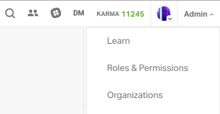
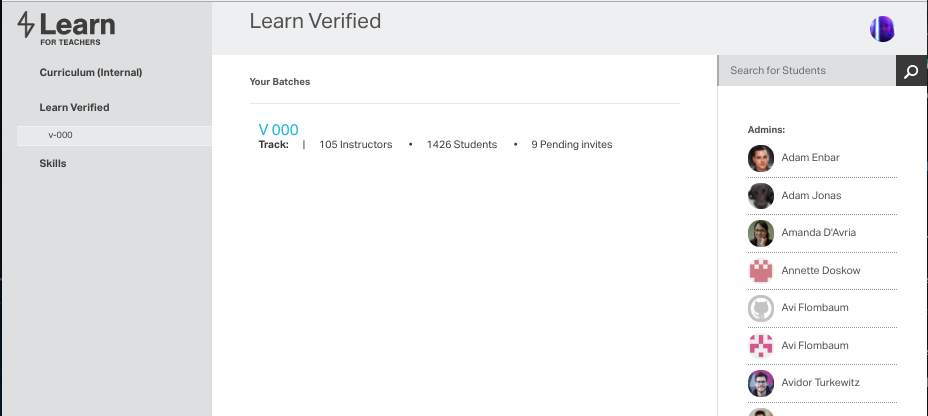
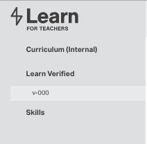
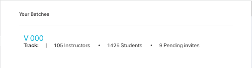
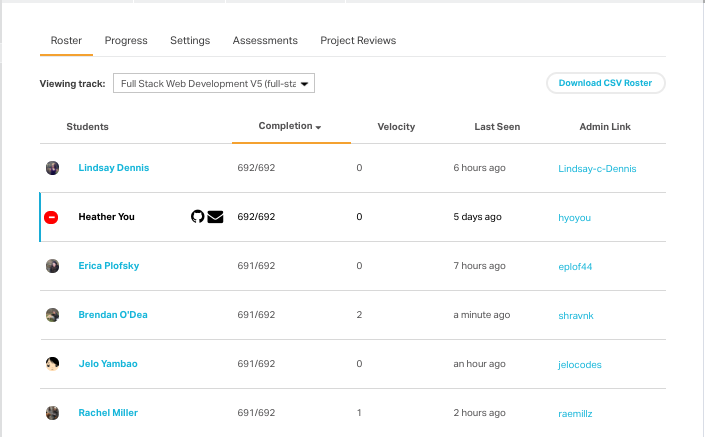
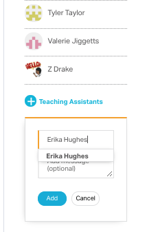
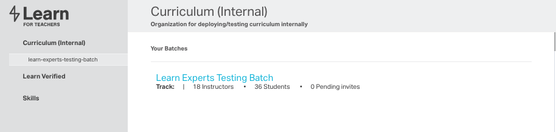
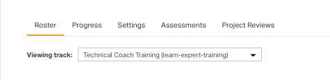
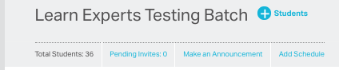

# Onboarding Checklist

## 3 days before their first day
[Please check off on this spreadsheet once your completed the onboarding checklist ](https://docs.google.com/spreadsheets/d/1agAXKRnfLiSLNjAnvR6LQl125ATnrI9tpBoBe6s_XHw/edit#gid=0)
- [ ] Add Technical Coach to the learn batches (v-000) as Teachers Assistant

- [ ] Add Technical Coach to the Technical Coach Training module as student

- [ ] Add Technical Coach to the slack channels
    -- #tc_updates
    -- #technical-coaches
    -- #yoursquadschannel

- [ ] Add Technical Coach to the instructor's app

- [ ] Add Technical Coach to flatiron-labs/teams/learn-expert group

- [ ] Add Technical Coach to squad email group

- [ ] Email Technical Coach to welcome them on the team.
    -- Tell them the expectation before their first day (completing the Training module) and what to expect the first day of onboarding.

# Add Technical Coach to the Technical Coach Training Module as a Student

Log into Learn.co

Click on `Admin` on the top right of the home screen

Select `Organizations` from the drop down menu

You should see something like this:

Once you're on the organizations page you will first need to remove the TC from Learn Verified.

From the organizations page make sure that you have `v-000` selected underneath `Learn Verified` on the left side bar:

Click on `V 000` - sometimes it can take a minute to load so be patient:

Once the list of students populates find the name of the TC that you need to remove, hover over their name and click the red minus button - **make sure the name is correct!** :

On this same page we need to add the new TC to the Teaching Assistants. This will give them access to expert chat. On the right side bar scroll down until you see `+ Teaching Assistants`. Click this button and either type in the TC's name or email(they should come up) and then click `Add` - **be sure that you have added the correct person!**:

Now we can add the TC to the Technical Coach Training Track! On the same page select `Curriculum (Internal)` and make sure `learn-expers-testing-batch` is highlighted:

Click on `Learn Experts Training Batch`. Once the list has loaded make sure that you are viewing the `Technical Coach Training` track:

Then Select the `+ Students` button on the top:

Where it says `Add students` type in the name of the TC(they should come up) and then click `Add Students`:

Double check the list to be sure that you've added the TC.

# Add Technical Coach to the Learn Batches as Teachers Assistant

Log into Learn.co

Select Admin from the top right of the screen

Select Organizations

On side of page take out of student list and add as TA

# Add Technical Coach to the slack channels

On slack select Flatiron Staff

Then Select Administration

Then Select Manage Memebers

Then select Invite New Members> Multi Channel Guests

Then add them to the following channels
 - 1. #technical-coaches
 - 2. #tc_updates
 - 3. #tc_support
 - 4. #virtualbox
 - 5. #squadchannelname

# Add Technical Coach to the instructor's app

Log into https://instruction.learn.co/staff/home

Select Admin

Select Users

Select Update Users

Add them to technical coach and staff

# Add Technical Coach to flatiron-labs/teams/learn-expert group

//TODO: figure out the steps

# Email Technical Coach to welcome them on the team.

Send the new TC a welcoming email outlining their first day and address general expectations. 

[Example welcome email](./welcome-email)

