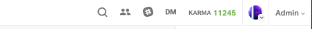

# Onboarding Checklist

[Please check off on this spreadsheet once your completed the onboarding checklist ](https://docs.google.com/spreadsheets/d/1agAXKRnfLiSLNjAnvR6LQl125ATnrI9tpBoBe6s_XHw/edit#gid=0)
- [ ] Add Technical Coach to the learn batches (v-000) as Teachers Assistant

- [ ] Add Technical Coach to the Technical Coach Training module as student

- [ ] Add Technical Coach to the slack channels

- [ ] Add Technical Coach to the instructor's app

- [ ] Add Technical Coach to flatiron-labs/teams/learn-expert group

- [ ] Add Technical Coach to squad email group

- [ ] Email Technical Coach to welcome them on the team

# Add Technical Coach to the Technical Coach Training Module as a Student

Log into Learn.co

Click on `Admin` on the top right of the home screen

Select `Organizations` from the drop down menu

You should see something like this:

Once you're on the organizations page you will first need to remove the TC from Learn Verified.

From the organizations page make sure that you have `v-000` selected underneath `Learn Verified` on the left side bar:

Click on `V 000` - sometimes it can take a minute to load so be patient:

Once the list of students populates find the name of the TC that you need to remove, hover over their name and click the red minus button - **make sure the name is correct!** :

Now we can add the TC to the Technical Coach Training Track! On the same page select `Curriculum (Internal)` and make sure `learn-expers-testing-batch` is highlighted:

Click on `Learn Experts Training Batch`. Once the list has loaded make sure that you are viewing the `Technical Coach Training` track:

Then Select the `+ Students` button on the top:

Where it says `Add students` type in the name of the TC(they should come up) and then click `Add Students`:

Double check the list to be sure that you've added the TC.

# Add Technical Coach to the Learn Batches as Teachers Assistant

Log into Learn.co

Select `Admin` from the top right of the screen:

Select `Organizations` from the dropdown menu:

From the organizations page make sure that you have `v-000` selected underneath `Learn Verified` on the left side bar:

Click on `V 000` - sometimes it can take a minute to load so be patient:

On this same page we need to add the new TC to the Teaching Assistants. This will give them access to expert chat. On the right side bar scroll down until you see `+ Teaching Assistants`. Click this button and either type in the TC's name or email(they should come up) and then click `Add` - **be sure that you have added the correct person!**:

# Add Technical Coach to the Slack Channels

On Slack click Flatiron Staff and then slect `Administration` in the dropdown menu:

Then Select `Manage Memebers`:

This should open a tab in your browser. From here click `Invite New Members`:

Select `Multi Channel Guests`:

Enter their email into the email address field and add them to the following channels
 - #technical-coaches
 - #tc_updates
 - #tc_support
 - #virtualbox
 - #squadchannelname

 Click `Invite Guests` to complete the process! 

# Add Technical Coach to the instructor's app

Log into https://instruction.learn.co/staff/home

From the home page hover over `Admin` and select `Users` from the dropdown menu:

Select `Update Users`:

Enter in their Github Username and click `Search`. Once the page loads with the information check the `Technical Coach` and `Staff` boxes.

# Add Technical Coach to flatiron-labs/teams/learn-expert group

//TODO: figure out the steps

# Email Technical Coach to welcome them on the team.

Send the new TC a welcoming email outlining their first day and address general expectations. Here is a good example of what it should look like:

>Welcome to [SQUAD NAME]!
>
>I am really excited that you are joining our squad!  I am looking forward to working with you!  My goal as a Technical Coach Lead is to make sure the channels of communication are open for the members of our cohort.  I will be having regular cohort meetings with the group and 1-on-1 meetings with each member.  Remember that if these meetings fall outside of your scheduled shift you must log them in workday and you will be paid for that time.  I will also be shadowing you on screen shares/dispatch twice a month as you work with students to give you any advice or tips that I think might help you going forward.
>
>I have added you to the TC Training Track which you will find on Learn.co in the pulldown curriculum menu.  Please try to go through it before your first shift.  I have also added you to several channels on slack:  The technical-coach channel which is where the TCs communicate during the shift, the tc_updates channel which is where you will get messages that are sent to all TCs, the tc_support channel which is where you can find common issues as well as their solutions, the virtualbox channel where you can find help for debugging VM issues and the [squad channel name] which is the channel for our cohort.
>
>You also have access now to https://learn.co/expert-chat# which is where we communicate with the students during the shift - it is the Ask A Question portal for TCs.  
>
>Finally, I have added you to the Learn Instructor App which is found at http://instruction.learn.co/staff/home.  There is a lot of good information here so take some time to look through it when you have a chance.
>
>I know that getting started it seems like a lot of information is coming at you.  Please feel free to DM me directly any time with any questions!  I am really looking forward to working with you and getting to know you.  Welcome to the team!
>
>Best,
>[TCL NAME]

[Example welcome email](./welcome-email)

